# 📋 TODO++ 详细设计文档

## 📖 文档概述

本文档详细描述了TODO++应用的系统架构、核心功能模块设计、数据模型、API接口和安全机制。TODO++是一个现代化的智能待办事项管理应用，集成了AI功能、用户数据隔离、智能提醒等先进特性。

### 🎯 应用特性
- ✅ 用户认证和数据隔离
- ✅ 双重API密钥管理机制
- ✅ 9个AI模型动态选择
- ✅ 智能待办事项管理
- ✅ 星标同步和日期过滤
- ✅ 实时提醒通知系统
- ✅ 响应式UI设计
- ✅ 生产级部署方案

## 1. 系统架构概述

### 1.1 整体架构图

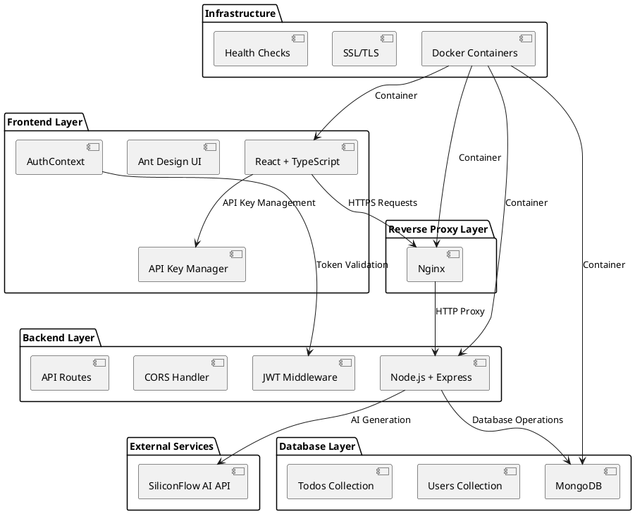

### 1.2 技术栈说明

#### 前端技术栈
- **React 18**: 现代化的用户界面框架
- **TypeScript**: 类型安全的JavaScript超集
- **Ant Design**: 企业级UI组件库
- **Axios**: HTTP客户端库
- **Day.js**: 轻量级日期处理库
- **Vite**: 快速的构建工具

#### 后端技术栈
- **Node.js**: JavaScript运行时环境
- **Express.js**: Web应用框架
- **MongoDB**: NoSQL文档数据库
- **Mongoose**: MongoDB对象建模工具
- **JWT**: JSON Web Token认证
- **bcrypt**: 密码加密库

#### 部署技术栈
- **Docker**: 容器化平台
- **Docker Compose**: 多容器应用编排
- **Nginx**: 反向代理和Web服务器
- **Let's Encrypt**: 免费SSL证书
- **Docker Hub**: 镜像仓库

### 1.3 部署架构

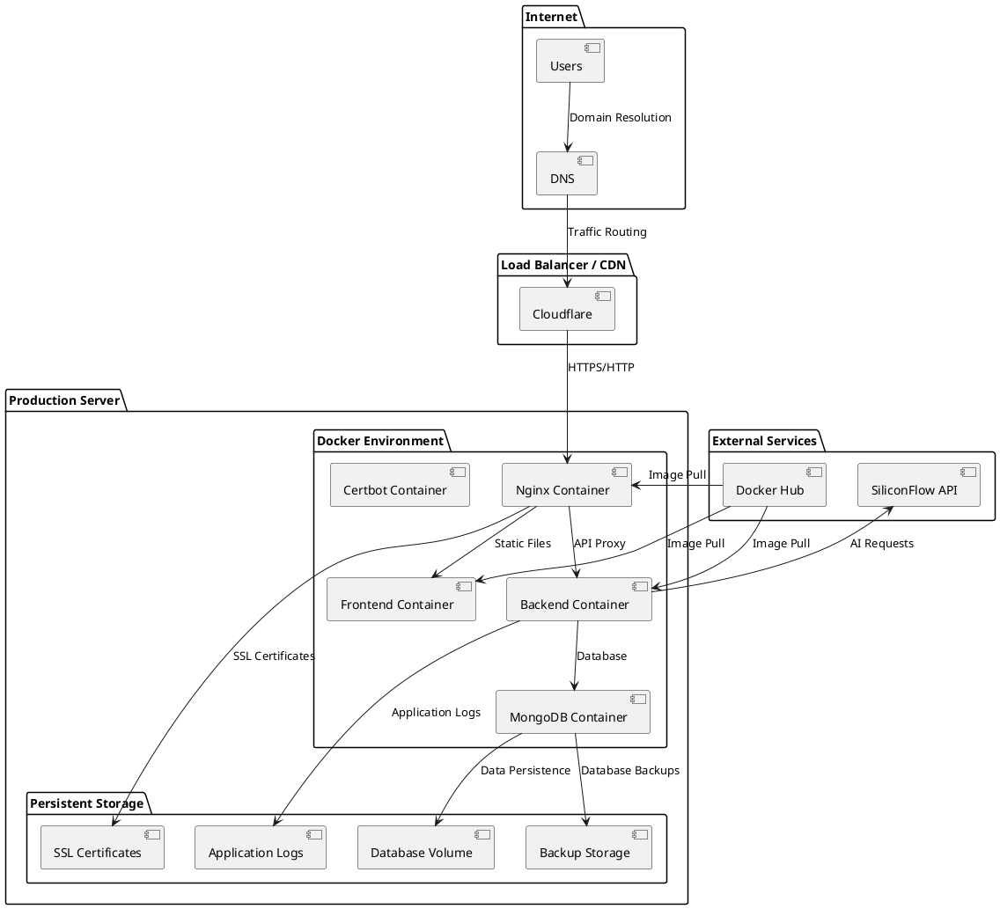

## 2. 核心功能模块详细设计

### 2.1 用户认证模块

#### 功能描述
用户认证模块负责用户的注册、登录、令牌管理和会话维护。采用JWT（JSON Web Token）机制实现无状态认证，确保系统的可扩展性和安全性。

#### 类设计

**AuthContext (React Context)**
```typescript
interface AuthContextType {
  user: User | null;
  token: string | null;
  login: (email: string, password: string) => Promise<boolean>;
  register: (userData: RegisterData) => Promise<boolean>;
  logout: () => void;
  isAuthenticated: boolean;
  loading: boolean;
}

interface User {
  _id: string;
  email: string;
  name: string;
  createdAt: string;
  lastLogin?: string;
}
```

**用户数据模型 (Backend)**
```typescript
interface UserSchema {
  _id: ObjectId;
  email: string;        // 唯一邮箱
  password: string;     // bcrypt加密密码
  name: string;         // 用户姓名
  createdAt: Date;      // 创建时间
  lastLogin: Date;      // 最后登录时间
  isActive: boolean;    // 账户状态
}
```

#### 算法设计

**密码加密流程**
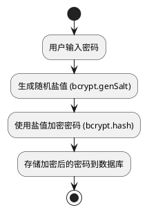

**JWT令牌验证流程**
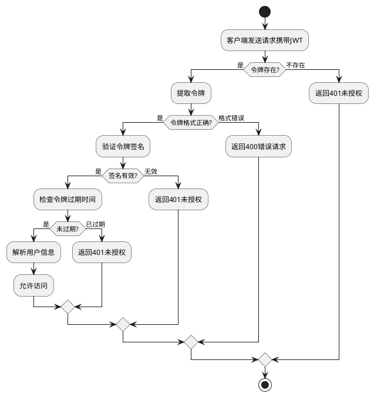

### 2.2 双重API密钥管理模块

#### 功能描述
双重API密钥管理模块实现了个人密钥与平台密钥的智能切换机制。当用户配置个人API密钥时，系统优先使用个人密钥；否则使用平台提供的默认密钥。这种设计既保证了系统的可用性，又给用户提供了灵活性。

#### 类设计

**aiApiKeyManager工具类**
```typescript
interface ApiKeyResult {
  apiKey: string;
  keyType: 'personal' | 'platform';
  keySource: string;
  model: string;
}

interface ApiKeyStatus {
  hasPersonalKey: boolean;
  currentKeyType: 'personal' | 'platform';
  userMessage: string;
  modelInfo: {
    currentModel: string;
    canModify: boolean;
    availableModels: string[];
  };
}

class ApiKeyManager {
  // 获取API密钥（双重机制）
  static getAiApiKey(): ApiKeyResult | null;

  // 存储个人API密钥
  static storeApiKey(apiKey: string): boolean;

  // 获取API密钥状态信息
  static getApiKeyStatus(): ApiKeyStatus;

  // 检查用户是否可以修改模型
  static canUserModifyModel(): boolean;

  // 验证API密钥格式
  static validateApiKeyFormat(apiKey: string): boolean;

  // 测试API密钥有效性
  static testApiKey(apiKey: string): Promise<TestResult>;
}
```

#### 算法设计

**密钥优先级选择逻辑**
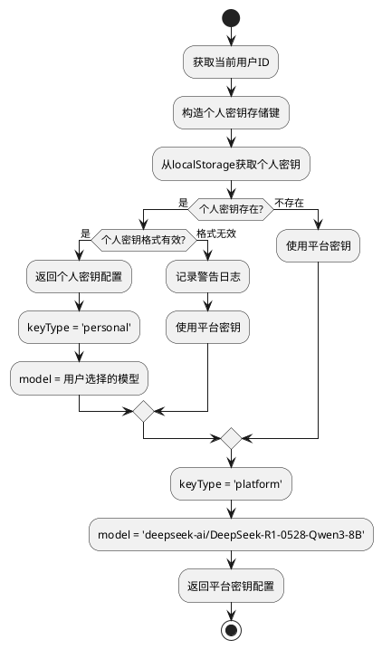

**API密钥验证流程**
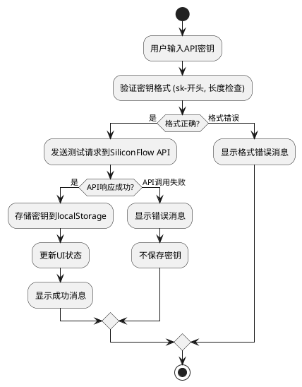

### 2.3 AI模型选择模块

#### 功能描述
AI模型选择模块支持9个不同的AI模型动态选择。个人密钥用户可以自由选择任意模型，平台密钥用户只能使用默认的DeepSeek模型。模型选择状态与用户账户绑定，实现个性化配置。

#### 类设计

**模型配置管理**
```typescript
interface ModelConfig {
  id: string;
  name: string;
  description: string;
  provider: string;
  maxTokens: number;
  supportedFeatures: string[];
}

interface ModelSelectionState {
  availableModels: ModelConfig[];
  currentModel: string;
  canModify: boolean;
  restrictions: {
    reason: string;
    upgradeHint: string;
  } | null;
}

class ModelManager {
  // 获取可用模型列表
  static getAvailableModels(): ModelConfig[];

  // 获取当前选择的模型
  static getCurrentModel(userId: string): string;

  // 设置用户选择的模型
  static setUserModel(userId: string, modelId: string): boolean;

  // 检查用户是否可以选择特定模型
  static canSelectModel(userId: string, modelId: string): boolean;

  // 获取模型配置信息
  static getModelConfig(modelId: string): ModelConfig | null;
}
```

#### 算法设计

**基于用户权限的模型可用性判断**
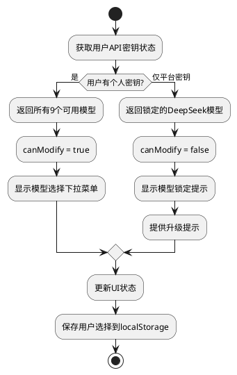

### 2.4 待办事项管理模块

#### 功能描述
待办事项管理模块是应用的核心功能，提供完整的CRUD操作、星标管理、状态切换、优先级设置等功能。支持AI智能生成、批量操作、数据同步等高级特性。

#### 类设计

**Todo数据模型**
```typescript
interface Todo {
  _id: string;
  user: string;              // 用户ID，确保数据隔离
  title: string;             // 待办标题
  description?: string;      // 详细描述
  dueDate: string;          // 截止日期 (ISO格式)
  priority: 'low' | 'medium' | 'high';  // 优先级
  status: 'pending' | 'completed';      // 状态
  isStarred: boolean;       // 是否星标
  isAIGenerated: boolean;   // 是否AI生成
  category?: string;        // 分类
  viewCategory: string;     // 视图分类
  createdAt: string;        // 创建时间
  updatedAt: string;        // 更新时间
  completedAt?: string;     // 完成时间
}

interface TodoOperations {
  // CRUD操作
  createTodo(todo: Partial<Todo>): Promise<Todo>;
  updateTodo(id: string, updates: Partial<Todo>): Promise<Todo>;
  deleteTodo(id: string): Promise<boolean>;
  getTodos(userId: string): Promise<Todo[]>;

  // 状态管理
  toggleComplete(id: string): Promise<boolean>;
  toggleStar(id: string): Promise<boolean>;
  setPriority(id: string, priority: Todo['priority']): Promise<boolean>;

  // 批量操作
  bulkDelete(ids: string[]): Promise<boolean>;
  bulkComplete(ids: string[]): Promise<boolean>;

  // AI生成
  generateTodosFromAI(prompt: string, context: TodoContext): Promise<Todo[]>;
}
```

#### 算法设计

**数据过滤、排序、分类逻辑**
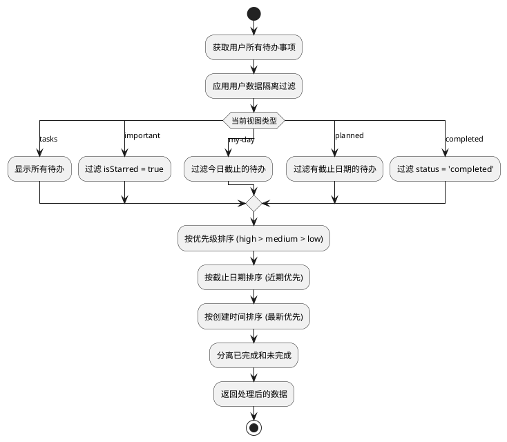

### 2.5 智能视图过滤模块

#### 功能描述
智能视图过滤模块实现了重要待办栏的星标同步机制和我的一天的日期过滤功能。当用户在任意视图中设置星标时，该待办会自动出现在重要视图中；我的一天视图会自动显示截止日期为当天的所有待办事项。

#### 类设计

**视图过滤器**
```typescript
interface ViewFilter {
  viewType: 'tasks' | 'important' | 'my-day' | 'planned' | 'completed';
  filterFunction: (todos: Todo[]) => Todo[];
  realTimeUpdate: boolean;
  dependencies: string[];
}

class ViewFilterManager {
  // 注册视图过滤器
  static registerFilter(viewType: string, filter: ViewFilter): void;

  // 应用视图过滤
  static applyFilter(viewType: string, todos: Todo[]): Todo[];

  // 实时更新过滤结果
  static updateFilteredView(viewType: string, todos: Todo[]): Todo[];

  // 星标同步处理
  static handleStarToggle(todoId: string, isStarred: boolean): void;

  // 日期变更处理
  static handleDateChange(newDate: Date): void;
}
```

#### 算法设计

**实时数据同步算法**
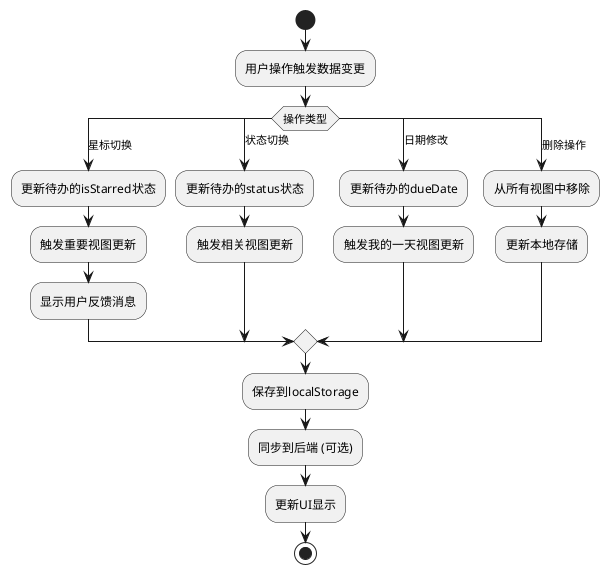

**日期匹配算法**
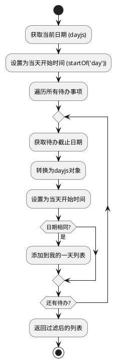

### 2.6 提醒通知系统

#### 功能描述
提醒通知系统提供定时提醒、浏览器通知、音效播放等功能。系统会解析用户设置的提醒时间（如"5分钟前"、"1小时前"），在指定时间触发通知，支持稍后提醒和标记完成等操作。

#### 类设计

**通知管理器**
```typescript
interface ReminderNotification {
  id: string;
  todo: Todo;
  timestamp: number;
  reminderTime: Date;
  status: 'pending' | 'triggered' | 'dismissed' | 'snoozed';
}

interface NotificationAction {
  label: string;
  action: 'snooze' | 'complete' | 'dismiss';
  handler: (notification: ReminderNotification) => void;
}

class NotificationManager {
  // 音频上下文管理
  private audioContext: AudioContext | null;
  private reminderSound: AudioBuffer | null;

  // 通知列表管理
  private notifications: ReminderNotification[];

  // 初始化音频系统
  initializeAudio(): Promise<void>;

  // 创建提醒音效
  createReminderSound(): AudioBuffer;

  // 解析提醒时间
  parseReminderTime(reminderText: string, dueDate: Date): Date;

  // 检查提醒时间
  checkReminders(): void;

  // 显示通知
  showNotification(todo: Todo): void;

  // 播放提醒音效
  playReminderSound(): void;

  // 请求浏览器通知权限
  requestNotificationPermission(): Promise<NotificationPermission>;

  // 处理通知操作
  handleNotificationAction(notificationId: string, action: string): void;
}
```

#### 算法设计

**时间解析算法**
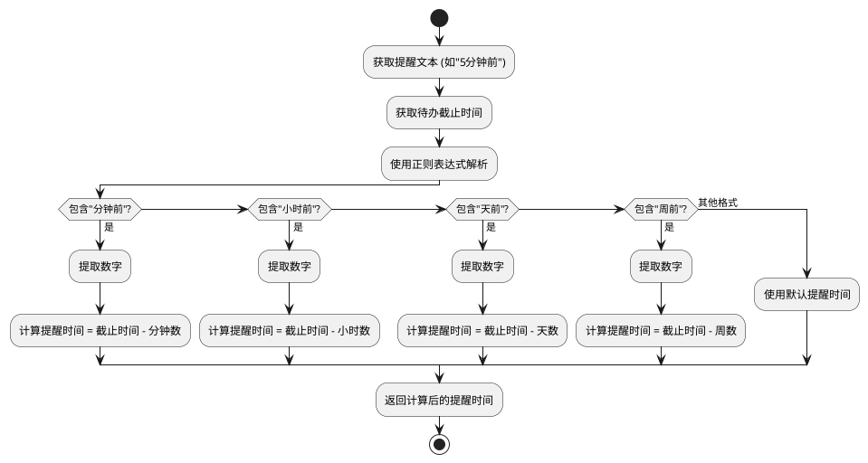

**提醒调度机制**
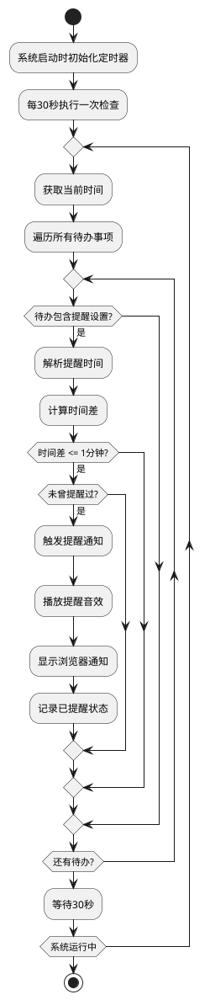

### 2.7 用户数据隔离模块

#### 功能描述
用户数据隔离模块确保每个用户只能访问自己的数据，防止数据泄露和越权访问。通过多层验证机制，包括前端过滤、后端验证、数据库查询限制等，构建完整的数据安全体系。

#### 类设计

**数据访问控制层**
```typescript
interface DataIsolationConfig {
  userId: string;
  userEmail: string;
  isolationLevel: 'strict' | 'normal';
  auditEnabled: boolean;
}

class DataAccessController {
  // 验证数据所有权
  static validateDataOwnership(data: any, userId: string): boolean;

  // 过滤用户数据
  static filterUserData<T extends { user?: string }>(
    data: T[],
    userId: string
  ): T[];

  // 强化数据隔离验证
  static validateUserDataIsolation(userId: string): ValidationResult;

  // 清理错误数据
  static cleanupContaminatedData(userId: string): CleanupResult;

  // 审计数据访问
  static auditDataAccess(
    operation: string,
    userId: string,
    dataId: string
  ): void;
}

interface ValidationResult {
  isValid: boolean;
  issues: DataIssue[];
  cleanupPerformed: boolean;
}

interface DataIssue {
  type: 'wrong_ownership' | 'missing_user_id' | 'contaminated_storage';
  description: string;
  affectedData: string[];
  severity: 'low' | 'medium' | 'high' | 'critical';
}
```

#### 算法设计

**用户ID验证机制**
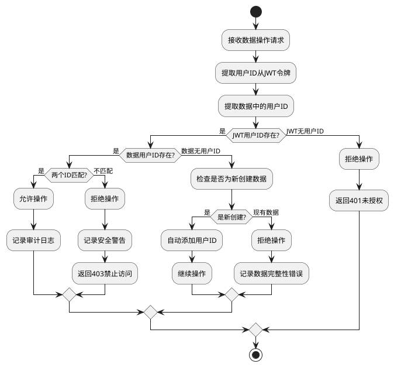

**数据过滤机制**
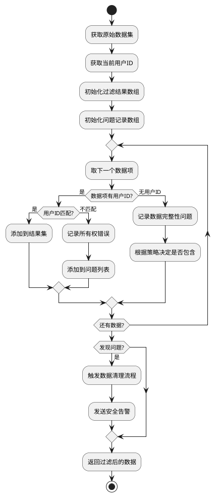

## 3. UML图表

### 3.1 顺序图（Sequence Diagrams）

#### 用户登录流程顺序图
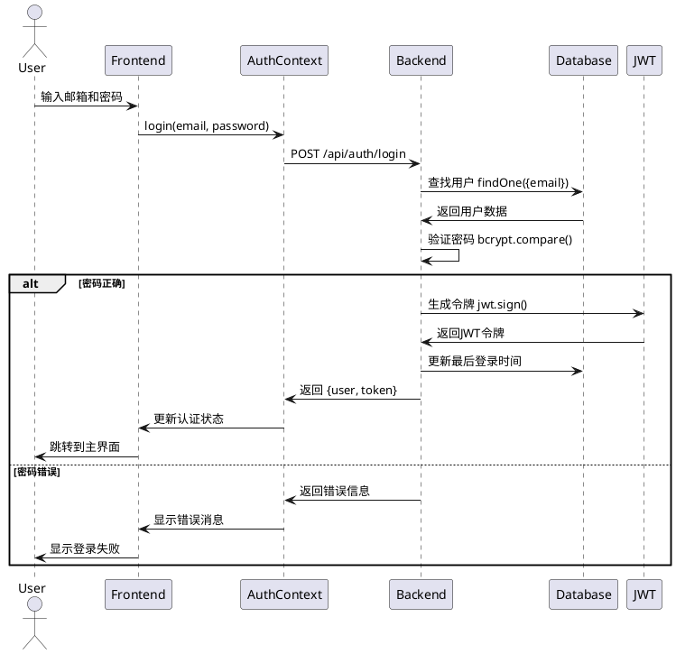

#### AI生成待办事项流程顺序图
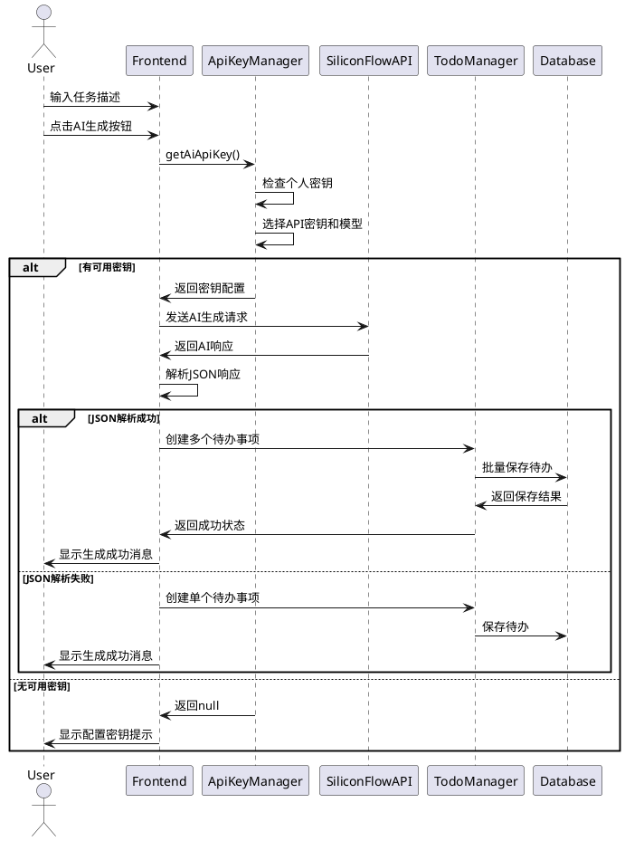

#### 星标同步机制顺序图
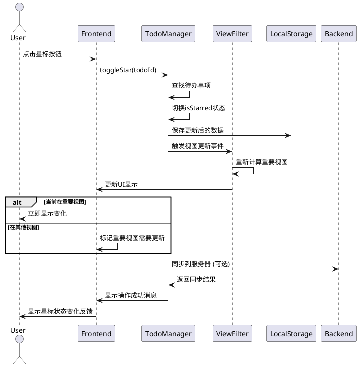

#### 提醒通知触发流程顺序图
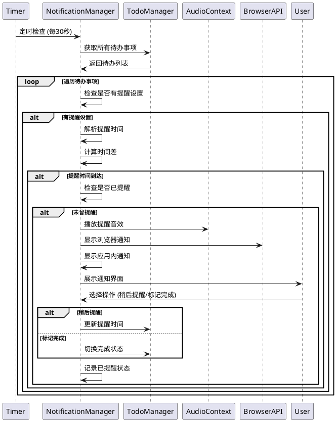

#### 数据隔离验证流程顺序图
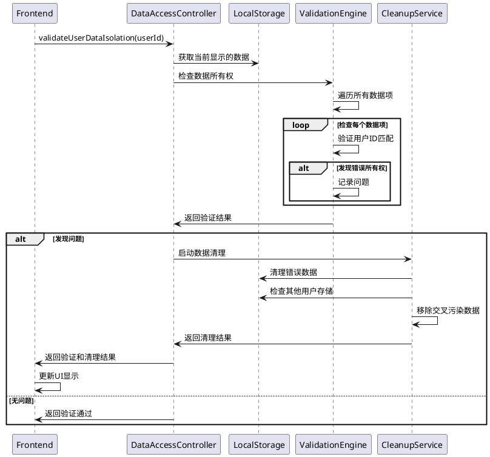

### 3.2 状态图（State Diagrams）

#### 待办事项状态转换图
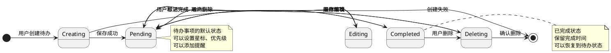

#### 用户认证状态图
```plantuml
@startuml User Authentication State Diagram
[*] -> Unauthenticated : 应用启动

Unauthenticated -> Authenticating : 用户登录
Unauthenticated -> Registering : 用户注册

Authenticating -> Authenticated : 登录成功
Authenticating -> Unauthenticated : 登录失败

Registering -> Authenticated : 注册成功
Registering -> Unauthenticated : 注册失败

Authenticated -> TokenRefreshing : 令牌即将过期
Authenticated -> Unauthenticated : 用户登出
Authenticated -> Unauthenticated : 令牌过期

TokenRefreshing -> Authenticated : 刷新成功
TokenRefreshing -> Unauthenticated : 刷新失败

note right of Authenticated
  用户已登录状态
  可以访问所有功能
  定期检查令牌有效性
end note

note right of Unauthenticated
  未登录状态
  只能访问登录/注册页面
  自动跳转到登录页
end note

@enduml
```

#### AI模型选择状态图
```plantuml
@startuml AI Model Selection State Diagram
[*] -> PlatformKey : 系统初始化

PlatformKey -> PersonalKeyConfiguring : 用户配置个人密钥
PlatformKey : 使用平台密钥
PlatformKey : 模型锁定为DeepSeek
PlatformKey : 显示升级提示

PersonalKeyConfiguring -> PersonalKeyActive : 密钥验证成功
PersonalKeyConfiguring -> PlatformKey : 密钥验证失败

PersonalKeyActive -> ModelSelecting : 用户选择模型
PersonalKeyActive : 使用个人密钥
PersonalKeyActive : 显示模型选择器

ModelSelecting -> PersonalKeyActive : 模型选择完成
ModelSelecting : 显示9个可用模型
ModelSelecting : 保存用户选择

PersonalKeyActive -> PlatformKey : 用户删除个人密钥

note right of PlatformKey
  平台密钥模式
  - 模型选择被锁定
  - 显示升级提示
  - 功能受限但可用
end note

note right of PersonalKeyActive
  个人密钥模式
  - 完整功能访问
  - 自由选择模型
  - 个性化配置
end note

@enduml
```

#### 提醒通知状态图
```plantuml
@startuml Reminder Notification State Diagram
[*] -> NotSet : 待办创建

NotSet -> Setting : 用户设置提醒
NotSet -> [*] : 待办删除

Setting -> Scheduled : 提醒时间确认
Setting -> NotSet : 取消设置

Scheduled -> Triggered : 提醒时间到达
Scheduled -> Cancelled : 用户取消提醒
Scheduled -> Rescheduled : 用户修改时间

Triggered -> Snoozed : 用户选择稍后提醒
Triggered -> Completed : 用户标记完成
Triggered -> Dismissed : 用户忽略提醒

Snoozed -> Scheduled : 设置新的提醒时间
Completed -> [*] : 待办完成
Dismissed -> [*] : 提醒结束
Cancelled -> NotSet : 返回未设置状态
Rescheduled -> Scheduled : 新时间生效

note right of Scheduled
  等待提醒状态
  - 定时器监控
  - 时间计算
  - 准备触发
end note

note right of Triggered
  提醒已触发
  - 显示通知
  - 播放音效
  - 等待用户操作
end note

@enduml
```

## 4. 数据模型设计

### 4.1 MongoDB集合结构设计

TODO++应用使用MongoDB作为主数据库，采用文档型数据存储。主要包含两个核心集合：用户集合（users）和待办事项集合（todos）。

#### 数据库架构图
```plantuml
@startuml Database Schema
!define TABLE class

package "TODO++ Database" {
  TABLE users {
    _id: ObjectId
    email: String (unique)
    password: String (hashed)
    name: String
    createdAt: Date
    lastLogin: Date
    isActive: Boolean
    preferences: Object
  }

  TABLE todos {
    _id: ObjectId
    user: ObjectId (ref: users)
    title: String
    description: String
    dueDate: Date
    priority: String
    status: String
    isStarred: Boolean
    isAIGenerated: Boolean
    category: String
    viewCategory: String
    createdAt: Date
    updatedAt: Date
    completedAt: Date
  }

  users ||--o{ todos : "一对多关系"
}

note right of users
  用户集合
  - 存储用户基本信息
  - 密码使用bcrypt加密
  - 支持软删除
end note

note right of todos
  待办事项集合
  - 通过user字段关联用户
  - 支持多种状态和分类
  - 包含AI生成标识
end note

@enduml
```

### 4.2 用户数据模型（User Schema）

```typescript
// MongoDB Schema定义
const UserSchema = new mongoose.Schema({
  email: {
    type: String,
    required: true,
    unique: true,
    lowercase: true,
    trim: true,
    validate: {
      validator: (email: string) => /^[^\s@]+@[^\s@]+\.[^\s@]+$/.test(email),
      message: '邮箱格式不正确'
    }
  },

  password: {
    type: String,
    required: true,
    minlength: 6,
    // 密码在保存前自动加密
    set: (password: string) => bcrypt.hashSync(password, 10)
  },

  name: {
    type: String,
    required: true,
    trim: true,
    maxlength: 50
  },

  createdAt: {
    type: Date,
    default: Date.now
  },

  lastLogin: {
    type: Date,
    default: Date.now
  },

  isActive: {
    type: Boolean,
    default: true
  },

  preferences: {
    theme: {
      type: String,
      enum: ['light', 'dark', 'auto'],
      default: 'light'
    },
    language: {
      type: String,
      enum: ['zh-CN', 'en-US'],
      default: 'zh-CN'
    },
    notifications: {
      email: { type: Boolean, default: true },
      browser: { type: Boolean, default: true },
      sound: { type: Boolean, default: true }
    }
  }
}, {
  timestamps: true,
  toJSON: {
    transform: (doc, ret) => {
      delete ret.password; // 序列化时移除密码
      return ret;
    }
  }
});

// 索引定义
UserSchema.index({ email: 1 }, { unique: true });
UserSchema.index({ createdAt: -1 });
UserSchema.index({ isActive: 1 });
```

### 4.3 待办事项数据模型（Todo Schema）

```typescript
// MongoDB Schema定义
const TodoSchema = new mongoose.Schema({
  user: {
    type: mongoose.Schema.Types.ObjectId,
    ref: 'User',
    required: true,
    index: true // 用户数据隔离的关键索引
  },

  title: {
    type: String,
    required: true,
    trim: true,
    maxlength: 200
  },

  description: {
    type: String,
    trim: true,
    maxlength: 1000,
    default: ''
  },

  dueDate: {
    type: Date,
    required: true,
    index: true // 日期过滤查询优化
  },

  priority: {
    type: String,
    enum: ['low', 'medium', 'high'],
    default: 'medium',
    index: true
  },

  status: {
    type: String,
    enum: ['pending', 'completed'],
    default: 'pending',
    index: true
  },

  isStarred: {
    type: Boolean,
    default: false,
    index: true // 重要待办查询优化
  },

  isAIGenerated: {
    type: Boolean,
    default: false
  },

  category: {
    type: String,
    trim: true,
    maxlength: 50
  },

  viewCategory: {
    type: String,
    enum: ['tasks', 'important', 'my-day', 'planned', 'assigned'],
    default: 'tasks',
    index: true
  },

  completedAt: {
    type: Date,
    default: null
  },

  // AI生成相关元数据
  aiMetadata: {
    model: String,
    prompt: String,
    generatedAt: Date,
    confidence: Number
  },

  // 提醒设置
  reminder: {
    enabled: { type: Boolean, default: false },
    time: Date,
    type: {
      type: String,
      enum: ['before_due', 'at_due', 'custom']
    },
    offset: Number, // 提前提醒的分钟数
    notified: { type: Boolean, default: false }
  }
}, {
  timestamps: true
});

// 复合索引定义
TodoSchema.index({ user: 1, status: 1 }); // 用户状态查询
TodoSchema.index({ user: 1, isStarred: 1 }); // 重要待办查询
TodoSchema.index({ user: 1, dueDate: 1 }); // 日期过滤查询
TodoSchema.index({ user: 1, viewCategory: 1 }); // 视图分类查询
TodoSchema.index({ user: 1, createdAt: -1 }); // 创建时间排序
TodoSchema.index({ 'reminder.time': 1, 'reminder.enabled': 1 }); // 提醒查询

// 中间件：自动设置completedAt
TodoSchema.pre('save', function(next) {
  if (this.isModified('status')) {
    if (this.status === 'completed' && !this.completedAt) {
      this.completedAt = new Date();
    } else if (this.status === 'pending') {
      this.completedAt = null;
    }
  }
  next();
});
```

### 4.4 数据关系图

```plantuml
@startuml Data Relationship Diagram
entity "User" as user {
  * _id : ObjectId
  --
  * email : String (unique)
  * password : String (hashed)
  * name : String
  createdAt : Date
  lastLogin : Date
  isActive : Boolean
  preferences : Object
}

entity "Todo" as todo {
  * _id : ObjectId
  --
  * user : ObjectId (FK)
  * title : String
  description : String
  * dueDate : Date
  priority : String
  status : String
  isStarred : Boolean
  isAIGenerated : Boolean
  category : String
  viewCategory : String
  createdAt : Date
  updatedAt : Date
  completedAt : Date
  aiMetadata : Object
  reminder : Object
}

user ||--o{ todo : "用户拥有多个待办事项"

note right of user
  用户表
  - 主键：_id
  - 唯一约束：email
  - 密码加密存储
  - 支持用户偏好设置
end note

note right of todo
  待办事项表
  - 外键：user (关联用户)
  - 支持多种状态和优先级
  - 包含AI生成元数据
  - 支持提醒功能
end note

@enduml
```

## 5. API接口设计

### 5.1 RESTful API端点列表

#### 认证相关API
```
POST   /api/auth/register     用户注册
POST   /api/auth/login        用户登录
POST   /api/auth/logout       用户登出
GET    /api/auth/profile      获取用户信息
PUT    /api/auth/profile      更新用户信息
POST   /api/auth/refresh      刷新令牌
```

#### 待办事项API
```
GET    /api/todos             获取用户待办列表
POST   /api/todos             创建新待办事项
GET    /api/todos/:id         获取特定待办事项
PUT    /api/todos/:id         更新待办事项
DELETE /api/todos/:id         删除待办事项
PATCH  /api/todos/:id/toggle  切换完成状态
PATCH  /api/todos/:id/star    切换星标状态
```

#### AI功能API
```
POST   /api/ai/generate       AI生成待办事项
POST   /api/ai/test-key       测试API密钥
GET    /api/ai/models         获取可用模型列表
```

#### 系统API
```
GET    /api/health            健康检查
GET    /api/version           版本信息
```

### 5.2 请求/响应数据格式

#### 用户注册API
```typescript
// POST /api/auth/register
interface RegisterRequest {
  email: string;
  password: string;
  name: string;
}

interface RegisterResponse {
  success: boolean;
  message: string;
  data?: {
    user: {
      _id: string;
      email: string;
      name: string;
      createdAt: string;
    };
    token: string;
  };
  error?: string;
}
```

#### 用户登录API
```typescript
// POST /api/auth/login
interface LoginRequest {
  email: string;
  password: string;
}

interface LoginResponse {
  success: boolean;
  message: string;
  data?: {
    user: {
      _id: string;
      email: string;
      name: string;
      lastLogin: string;
    };
    token: string;
  };
  error?: string;
}
```

#### 获取待办列表API
```typescript
// GET /api/todos?status=pending&starred=true&limit=50&offset=0
interface TodoListRequest {
  status?: 'pending' | 'completed';
  starred?: boolean;
  category?: string;
  viewCategory?: string;
  dueDate?: string; // ISO date string
  limit?: number;
  offset?: number;
  sortBy?: 'createdAt' | 'dueDate' | 'priority';
  sortOrder?: 'asc' | 'desc';
}

interface TodoListResponse {
  success: boolean;
  data: {
    todos: Todo[];
    total: number;
    limit: number;
    offset: number;
    hasMore: boolean;
  };
  message: string;
}
```

#### 创建待办事项API
```typescript
// POST /api/todos
interface CreateTodoRequest {
  title: string;
  description?: string;
  dueDate: string; // ISO date string
  priority?: 'low' | 'medium' | 'high';
  category?: string;
  viewCategory?: string;
  isStarred?: boolean;
  reminder?: {
    enabled: boolean;
    time?: string; // ISO date string
    type?: 'before_due' | 'at_due' | 'custom';
    offset?: number;
  };
}

interface CreateTodoResponse {
  success: boolean;
  message: string;
  data?: {
    todo: Todo;
  };
  error?: string;
}
```

#### AI生成待办API
```typescript
// POST /api/ai/generate
interface AIGenerateRequest {
  prompt: string;
  context?: {
    dueDate?: string;
    priority?: string;
    category?: string;
    viewCategory?: string;
  };
  apiKey?: string; // 个人API密钥（可选）
  model?: string;  // 指定模型（可选）
}

interface AIGenerateResponse {
  success: boolean;
  message: string;
  data?: {
    tasks: Array<{
      title: string;
      description?: string;
      priority?: string;
      dueDate?: string;
    }>;
    metadata: {
      model: string;
      keyType: 'personal' | 'platform';
      generatedAt: string;
      tokensUsed?: number;
    };
  };
  error?: string;
}
```

### 5.3 错误处理机制

#### 标准错误响应格式
```typescript
interface ErrorResponse {
  success: false;
  error: {
    code: string;
    message: string;
    details?: any;
    timestamp: string;
    requestId: string;
  };
}

// 错误代码定义
enum ErrorCodes {
  // 认证错误 (4xx)
  UNAUTHORIZED = 'AUTH_001',
  INVALID_TOKEN = 'AUTH_002',
  TOKEN_EXPIRED = 'AUTH_003',
  INVALID_CREDENTIALS = 'AUTH_004',

  // 验证错误 (4xx)
  VALIDATION_ERROR = 'VAL_001',
  MISSING_REQUIRED_FIELD = 'VAL_002',
  INVALID_FORMAT = 'VAL_003',

  // 资源错误 (4xx)
  RESOURCE_NOT_FOUND = 'RES_001',
  RESOURCE_ALREADY_EXISTS = 'RES_002',
  ACCESS_DENIED = 'RES_003',

  // 服务器错误 (5xx)
  INTERNAL_SERVER_ERROR = 'SRV_001',
  DATABASE_ERROR = 'SRV_002',
  EXTERNAL_API_ERROR = 'SRV_003',

  // AI相关错误
  AI_API_KEY_INVALID = 'AI_001',
  AI_MODEL_UNAVAILABLE = 'AI_002',
  AI_GENERATION_FAILED = 'AI_003'
}
```

#### 错误处理中间件
```typescript
// Express错误处理中间件
const errorHandler = (
  err: Error,
  req: Request,
  res: Response,
  next: NextFunction
) => {
  const requestId = req.headers['x-request-id'] || generateRequestId();

  // 记录错误日志
  logger.error({
    error: err.message,
    stack: err.stack,
    requestId,
    url: req.url,
    method: req.method,
    userId: req.user?._id
  });

  // 根据错误类型返回相应的HTTP状态码
  let statusCode = 500;
  let errorCode = ErrorCodes.INTERNAL_SERVER_ERROR;

  if (err instanceof ValidationError) {
    statusCode = 400;
    errorCode = ErrorCodes.VALIDATION_ERROR;
  } else if (err instanceof AuthenticationError) {
    statusCode = 401;
    errorCode = ErrorCodes.UNAUTHORIZED;
  } else if (err instanceof NotFoundError) {
    statusCode = 404;
    errorCode = ErrorCodes.RESOURCE_NOT_FOUND;
  }

  const errorResponse: ErrorResponse = {
    success: false,
    error: {
      code: errorCode,
      message: err.message,
      timestamp: new Date().toISOString(),
      requestId
    }
  };

  res.status(statusCode).json(errorResponse);
};
```

## 6. 安全设计

### 6.1 用户数据隔离机制

#### 多层数据隔离策略
```plantuml
@startuml Data Isolation Strategy
package "前端层隔离" {
  [用户ID验证] as FrontendValidation
  [本地存储隔离] as LocalStorageIsolation
  [UI状态隔离] as UIStateIsolation
}

package "API层隔离" {
  [JWT令牌验证] as JWTValidation
  [请求参数验证] as RequestValidation
  [用户权限检查] as PermissionCheck
}

package "业务层隔离" {
  [数据所有权验证] as OwnershipValidation
  [查询条件注入] as QueryInjection
  [结果集过滤] as ResultFiltering
}

package "数据层隔离" {
  [数据库索引] as DatabaseIndex
  [查询优化] as QueryOptimization
  [数据完整性约束] as IntegrityConstraints
}

FrontendValidation --> JWTValidation
LocalStorageIsolation --> RequestValidation
UIStateIsolation --> PermissionCheck

JWTValidation --> OwnershipValidation
RequestValidation --> QueryInjection
PermissionCheck --> ResultFiltering

OwnershipValidation --> DatabaseIndex
QueryInjection --> QueryOptimization
ResultFiltering --> IntegrityConstraints

@enduml
```

#### 数据隔离实现机制
```typescript
// 数据访问控制装饰器
const requireDataOwnership = (
  target: any,
  propertyName: string,
  descriptor: PropertyDescriptor
) => {
  const method = descriptor.value;

  descriptor.value = async function(...args: any[]) {
    const userId = this.getCurrentUserId();
    const resourceId = args[0]; // 假设第一个参数是资源ID

    // 验证资源所有权
    const resource = await this.findById(resourceId);
    if (!resource || resource.user.toString() !== userId) {
      throw new AccessDeniedError('无权访问此资源');
    }

    return method.apply(this, args);
  };
};

// 查询条件自动注入用户ID
class TodoService {
  @requireDataOwnership
  async updateTodo(todoId: string, updates: Partial<Todo>) {
    const userId = this.getCurrentUserId();

    // 自动注入用户ID到查询条件
    const result = await TodoModel.findOneAndUpdate(
      { _id: todoId, user: userId }, // 确保只能更新自己的数据
      updates,
      { new: true }
    );

    return result;
  }

  async getUserTodos(userId: string, filters: TodoFilters) {
    // 强制添加用户ID过滤条件
    const query = {
      user: userId,
      ...filters
    };

    return TodoModel.find(query)
      .sort({ createdAt: -1 })
      .limit(filters.limit || 50);
  }
}
```

### 6.2 API密钥安全存储

#### 前端密钥管理策略
```typescript
class SecureApiKeyManager {
  private static readonly ENCRYPTION_KEY = 'user-specific-key';

  // 加密存储API密钥
  static storeApiKey(apiKey: string, userId: string): boolean {
    try {
      // 使用用户特定的存储键
      const storageKey = `apiKey_${userId}`;

      // 简单的混淆处理（生产环境应使用更强的加密）
      const obfuscated = btoa(apiKey + userId);

      localStorage.setItem(storageKey, obfuscated);

      // 设置过期时间（可选）
      const expiryKey = `apiKeyExpiry_${userId}`;
      const expiry = Date.now() + (30 * 24 * 60 * 60 * 1000); // 30天
      localStorage.setItem(expiryKey, expiry.toString());

      return true;
    } catch (error) {
      console.error('API密钥存储失败:', error);
      return false;
    }
  }

  // 安全获取API密钥
  static getApiKey(userId: string): string | null {
    try {
      const storageKey = `apiKey_${userId}`;
      const expiryKey = `apiKeyExpiry_${userId}`;

      // 检查过期时间
      const expiry = localStorage.getItem(expiryKey);
      if (expiry && Date.now() > parseInt(expiry)) {
        this.removeApiKey(userId);
        return null;
      }

      const obfuscated = localStorage.getItem(storageKey);
      if (!obfuscated) return null;

      // 解密
      const decrypted = atob(obfuscated);
      const apiKey = decrypted.replace(userId, '');

      return apiKey;
    } catch (error) {
      console.error('API密钥获取失败:', error);
      return null;
    }
  }

  // 安全删除API密钥
  static removeApiKey(userId: string): void {
    const storageKey = `apiKey_${userId}`;
    const expiryKey = `apiKeyExpiry_${userId}`;

    localStorage.removeItem(storageKey);
    localStorage.removeItem(expiryKey);
  }
}
```

### 6.3 CORS和安全头配置

#### Nginx安全头配置
```nginx
# 安全头配置
add_header X-Frame-Options DENY;
add_header X-Content-Type-Options nosniff;
add_header X-XSS-Protection "1; mode=block";
add_header Referrer-Policy "strict-origin-when-cross-origin";
add_header Strict-Transport-Security "max-age=31536000; includeSubDomains" always;

# 内容安全策略
add_header Content-Security-Policy "
  default-src 'self';
  script-src 'self' 'unsafe-inline' 'unsafe-eval' https://api.siliconflow.cn;
  style-src 'self' 'unsafe-inline' https://fonts.googleapis.com;
  font-src 'self' https://fonts.gstatic.com;
  img-src 'self' data: https:;
  connect-src 'self' https://api.siliconflow.cn;
  frame-ancestors 'none';
";

# API频率限制
limit_req_zone $binary_remote_addr zone=api:10m rate=10r/s;
limit_req_zone $binary_remote_addr zone=login:10m rate=5r/m;

location /api/ {
  limit_req zone=api burst=20 nodelay;
  # 其他配置...
}

location /api/auth/login {
  limit_req zone=login burst=3 nodelay;
  # 其他配置...
}
```

#### Express CORS配置
```typescript
import cors from 'cors';

const corsOptions: cors.CorsOptions = {
  origin: (origin, callback) => {
    // 允许的域名列表
    const allowedOrigins = [
      'http://localhost:3000',
      'https://your-domain.com',
      'https://www.your-domain.com'
    ];

    // 开发环境允许无origin的请求（如移动应用）
    if (!origin && process.env.NODE_ENV === 'development') {
      return callback(null, true);
    }

    if (allowedOrigins.includes(origin!)) {
      callback(null, true);
    } else {
      callback(new Error('CORS策略不允许此来源'));
    }
  },

  credentials: true, // 允许携带凭据

  methods: ['GET', 'POST', 'PUT', 'DELETE', 'PATCH', 'OPTIONS'],

  allowedHeaders: [
    'Origin',
    'X-Requested-With',
    'Content-Type',
    'Accept',
    'Authorization',
    'X-Request-ID'
  ],

  exposedHeaders: ['X-Request-ID'],

  maxAge: 86400 // 预检请求缓存时间（24小时）
};

app.use(cors(corsOptions));
```

---

## 📋 总结

本详细设计文档全面描述了TODO++应用的系统架构、核心功能模块、数据模型、API接口和安全机制。文档基于当前已实现的功能，包括：

### 🎯 核心特性
- ✅ **用户认证和数据隔离**：JWT令牌认证，多层数据隔离机制
- ✅ **双重API密钥管理**：个人密钥与平台密钥智能切换
- ✅ **AI模型选择**：支持9个AI模型的动态选择
- ✅ **智能待办管理**：完整的CRUD操作，星标同步，状态管理
- ✅ **智能视图过滤**：重要待办栏星标同步，我的一天日期过滤
- ✅ **提醒通知系统**：定时提醒，浏览器通知，音效播放
- ✅ **生产级部署**：Docker容器化，Nginx反向代理，SSL支持

### 🏗️ 技术架构
- **前端**：React + TypeScript + Ant Design
- **后端**：Node.js + Express + MongoDB
- **部署**：Docker + Nginx + Let's Encrypt
- **安全**：JWT认证 + CORS + 数据隔离 + 安全头

### 📊 设计亮点
- **模块化设计**：清晰的模块划分和接口定义
- **安全优先**：多层数据隔离和安全防护
- **可扩展性**：支持负载均衡和水平扩展
- **用户体验**：智能同步和实时通知
- **生产就绪**：完整的监控、备份和运维方案

该设计文档为TODO++应用的开发、维护和扩展提供了完整的技术指导。
```